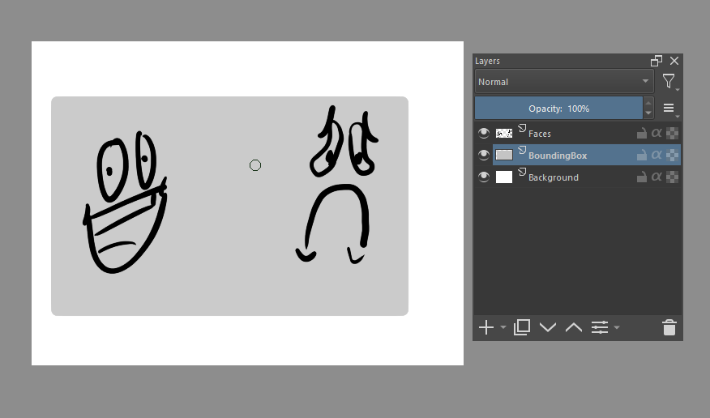

# Krita Export Region
Adds an "Export Region..." option to the file menu that allows you to only export the contents of a selected region. If no region is selected, then it will crop the image to fit the bounds of the currently selected layer.

## Examples
Running "Export Region..." with an area selected will export an image cropped to the selected area. For example, the following selection:

Would export this:

If you don't have an area selected, the image will be cropped to whatever layer is currently selected. For example, if we have the BoundingBox layer selected:

Then the exported image would be this:

## Installation

